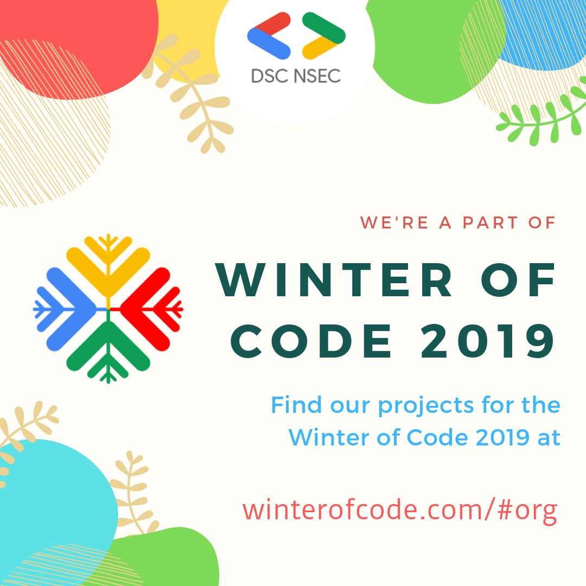

## DSC NSEC Forum App

#### Breif Description

The DSC NSEC Forum is a platform for disccussion of technical queries, new tecchnology topics and much more. The forum is accessible at - [forum.dscnsec.com](https://forum.dscnsec.com). 

The chief idea of this project is to make an android/iOS application that will be able to substitute the use of the website for the mobile users. The application should have 
all the features that the forum currently supports which includes: 

* user sign up/log in
* adding new posts
* adding comments 
* user level features
* upvote system 
* block list implementation

The repository code for the forum is available at: [https://github.com/dscnsec/Florum](https://github.com/dscnsec/Florum).
The database of the project is hoisted in an Azure cloud VM. The app needs to fetch all data from the hoisted database. 

#### Tech Stack 

You can choose any of the following tech stacks:

* Flutter
* Android Native(Java)
* Android Native(Kotlin)

#### Note for the participants

The date for the submission of project proposal is 14th october, 2019. Your proposal should include: 

1. A short description of what you understand about the project idea. 
2. Clear and understandable wireframe design of the application
3. List of the features that you would be able to implement
4. Any additional ideas/features that you might want to implement or which you think will make the application better.

We will work on the design aspects and the fluency of the application. The application should work exactly like or even better than the website, and should scale fluently. Releasing an application on the play/app store would be our main concern.

The date for the initial evaluation and the final evaluation is available at the Winter of Code website at [winterofcode.com/index.html](https://winterofcode.com/index.html).

#### How to contact us 

In the initial bonding period you can talk to us mentors and clear any doubt that you may have regarding the project.
The official slack workspace of DSC NSEC is : [DSC NSEC Slack](https://tiny.cc/dscnsec-slack)
The channels for Winter Of Code is `winterofcode` and the channel for this project is `dsc-nsec-forum-app-woc2019`. In case of any doubts hit us up on slack and we will get back to you.

#### About the mentors

Aritra Roy Gosthipaty [Slack](https://dscnsec.slack.com/team/UMWJVK9UJ) [Github](https://github.com/ariG23498)
Arnab Chanda [Slack](https://dscnsec.slack.com/team/UFUP3GABU) [Github](https://github.com/Arnie09)